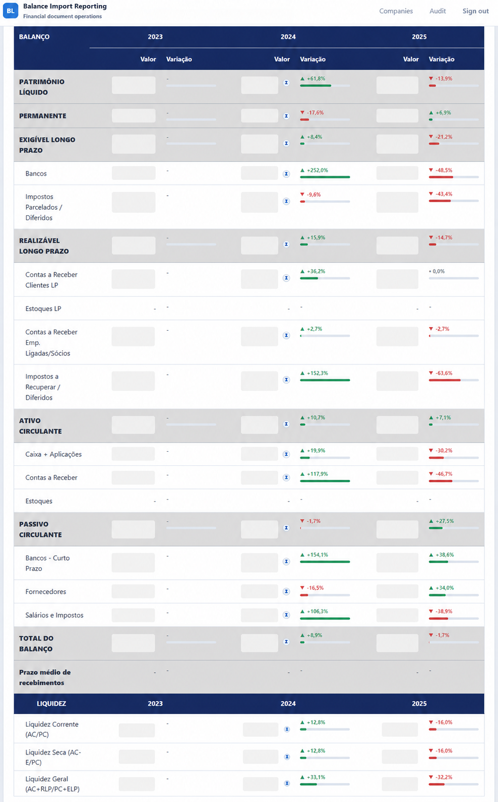
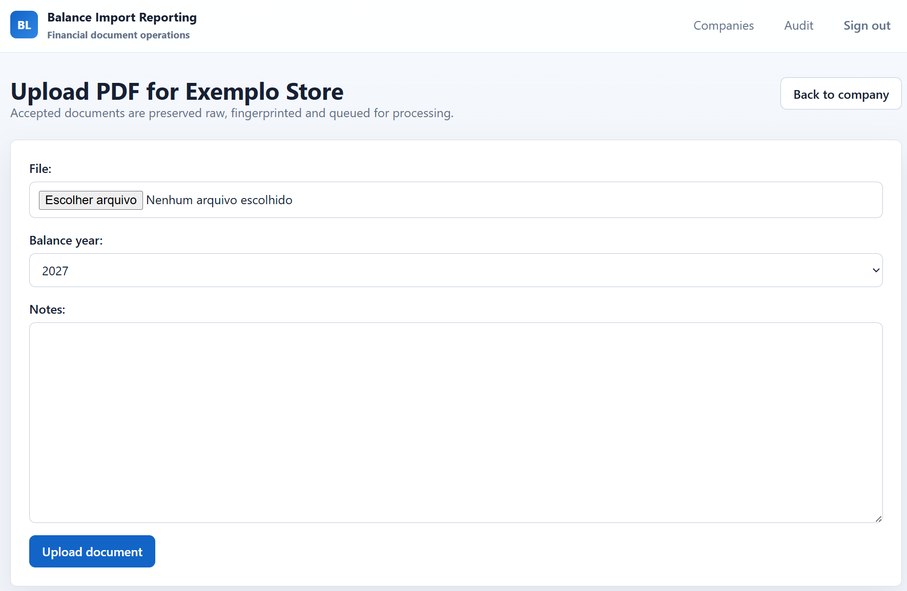
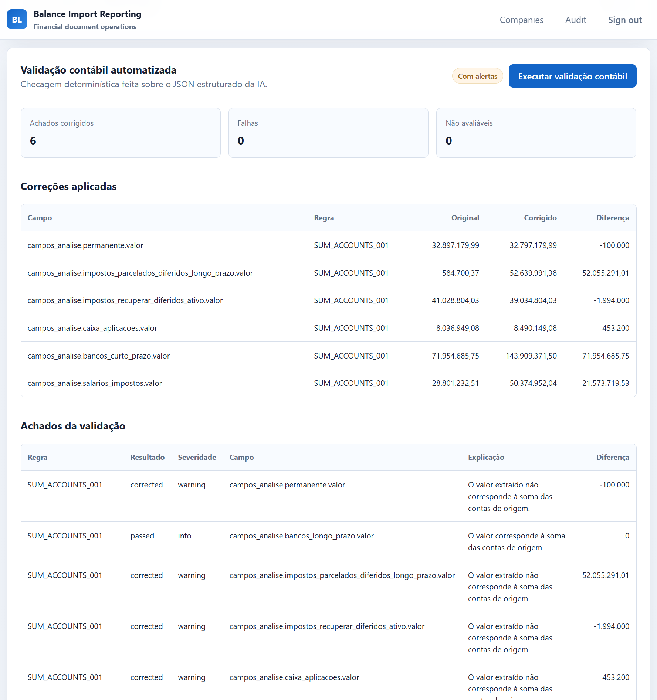
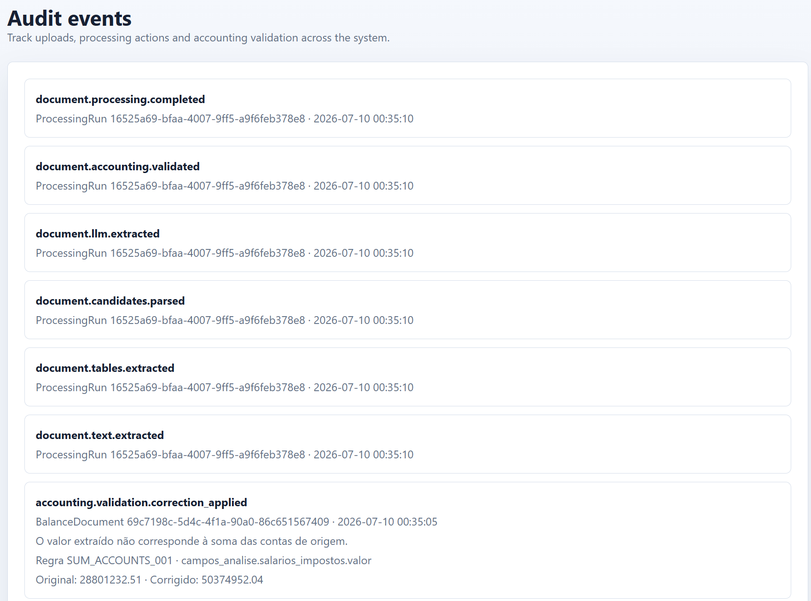
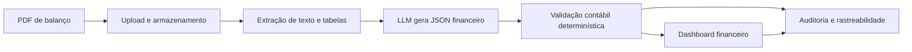
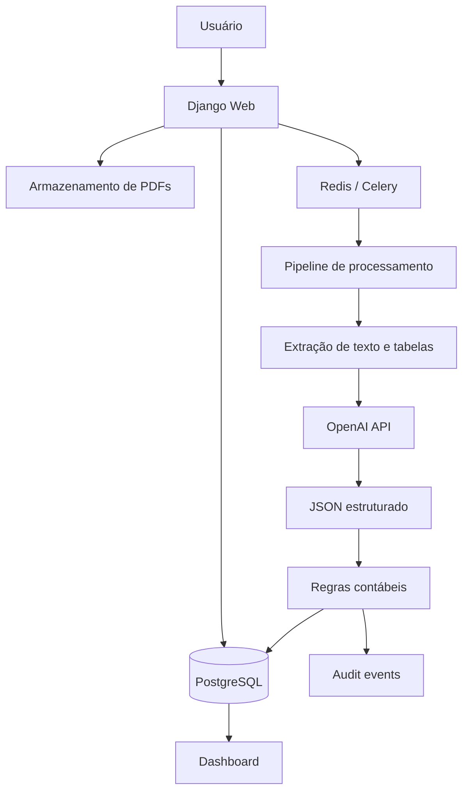

# Balanço LLM

Projeto de ciência de dados aplicada para transformar balanços empresariais em
PDF em dados financeiros estruturados, validados por regras contábeis
determinísticas e apresentados em dashboards auditáveis.

## Visão Geral

Muitos balanços empresariais chegam como PDFs pouco padronizados. Isso dificulta
a análise financeira comparável entre empresas e períodos, principalmente quando
os dados precisam ser auditáveis.

O Balanco LLM transforma esse fluxo em um pipeline analítico:

- recebe PDFs de balanços por empresa;
- preserva o documento original;
- extrai texto e tabelas do PDF;
- usa LLM para gerar um JSON financeiro estruturado;
- aplica validações contábeis determinísticas sobre o output da IA;
- registra eventos e correções em trilha de auditoria;
- disponibiliza os dados em dashboard para comparação entre períodos.

## Demonstração Visual

### Dashboard financeiro

Visão consolidada dos valores extraídos e organizados por empresa/período.



### Upload de documento

Entrada do pipeline: o usuário cadastra o documento e envia o PDF do balanço.



### Validação contábil

Depois da extração estruturada, regras determinísticas verificam consistência,
recalculam campos quando possível e registram achados.



### Auditoria

Eventos do pipeline, validações e correções ficam registrados para reconstruir
como o dado final foi produzido.



## Pipeline



## Arquitetura



## Abordagem de Desenvolvimento

O projeto foi conduzido com apoio de IA generativa de forma estruturada. Em vez
de usar prompts isolados, utilizei Spec Kit para organizar especificação,
planejamento e tarefas de implementação em artefatos versionados.

Essa abordagem ajudou a manter:

- requisitos explícitos para o pipeline de extração e validação;
- decisões técnicas documentadas antes da implementação;
- tarefas pequenas e verificáveis;
- separação entre geração estruturada por LLM e validação determinística;
- rastreabilidade entre problema de negócio, regras contábeis e código.

A ênfase do projeto está na construção de um fluxo de dados confiável para
documentos financeiros: entrada não estruturada, estruturação por IA, validação
contábil, auditoria e visualização analítica.

## Funcionalidades

- Cadastro de empresas e períodos.
- Upload e preservação de PDFs originais.
- Processamento assíncrono com Celery e Redis.
- Extração de texto/tabelas com bibliotecas Python para PDF.
- Estruturação financeira via OpenAI API.
- Validação contábil sem nova chamada à IA.
- Correção determinística de campos calculáveis por soma de contas.
- Checagem da equação patrimonial básica.
- Estimativa de tokens e custo da extração.
- Dashboard server-rendered em Django.
- Auditoria de upload, processamento, extração e validação.

## Regras Contábeis

O sistema não trata a saída da LLM como verdade final. A extração estruturada é
validada por regras determinísticas, por exemplo:

- `SUM_ACCOUNTS_001`: recalcula campos cujo valor deveria ser a soma de contas
  de origem e registra correção quando a diferença passa da tolerância.
- `BALANCE_EQUATION_001`: avalia a consistência básica do balanço pela relação
  entre ativos, passivos e patrimônio líquido.

Essa separação é intencional: a LLM estrutura dados desorganizados, enquanto a
camada contábil aplica regras explícitas, testáveis e auditáveis.

## Stack

- Python 3.12
- Django 5
- PostgreSQL
- Redis
- Celery
- OpenAI API
- PyMuPDF, pdfplumber e OCRmyPDF
- Docker Compose
- pytest e pytest-django

## Estrutura do Projeto

```text
app/
  accounting/        validação contábil determinística
  audit/             trilha de auditoria
  companies/         cadastro de empresas e períodos
  config/            settings, urls e Celery
  dashboard/         visualizações financeiras
  documents/         upload e armazenamento de PDFs
  extraction/        pipeline de extração estruturada
  standardization/   padronização de valores
  templates/         telas server-rendered
  tests/             testes unitários, integração e contrato

docs/
  screenshots/       imagens usadas neste README

docker/
  web.Dockerfile
  worker.Dockerfile
```

## Como Rodar Localmente

### Opção 1: ambiente local simples

Crie e ative o ambiente virtual:

```powershell
python -m venv .venv
.venv\Scripts\Activate.ps1
```

Instale as dependências:

```powershell
python -m pip install --upgrade pip
python -m pip install -e ".[dev]"
```

Crie um `.env` local:

```powershell
Copy-Item .env.example .env
```

Para rodar sem Docker, ajuste o `.env`:

```text
DJANGO_DEBUG=true
DJANGO_ALLOWED_HOSTS=127.0.0.1,localhost
DJANGO_CSRF_TRUSTED_ORIGINS=http://127.0.0.1:8000,http://localhost:8000
CELERY_TASK_ALWAYS_EAGER=true
MEDIA_ROOT=app/media
MEDIA_URL=/media/
```

Remova `DATABASE_URL` ou troque por uma URL válida fora do Docker.

Prepare o banco:

```powershell
python app/manage.py migrate
python app/manage.py load_standard_line_items
python app/manage.py bootstrap_roles
python app/manage.py createsuperuser
```

Suba a aplicação:

```powershell
python app/manage.py runserver
```

Acesse:

- `http://127.0.0.1:8000/login/`
- `http://127.0.0.1:8000/admin/`

### Opção 2: Docker Compose

```powershell
docker compose up --build
```

Em outro terminal:

```powershell
docker compose exec web python app/manage.py migrate
docker compose exec web python app/manage.py load_standard_line_items
docker compose exec web python app/manage.py bootstrap_roles
docker compose exec web python app/manage.py createsuperuser
```

### Opção 3: teste real com OpenAI, Postgres, Redis e worker

Crie um `.env` local a partir do exemplo realista:

```powershell
Copy-Item .env.real.example .env
```

Preencha no `.env`:

```text
SECRET_KEY=<uma chave longa e aleatória>
OPENAI_API_KEY=<sua chave real>
OPENAI_BALANCE_EXTRACTION_ENABLED=true
```

O `.env` é ignorado pelo Git. Não coloque chaves reais em `.env.example`.

Para teste local via HTTP, mantenha:

```text
SESSION_COOKIE_SECURE=false
CSRF_COOKIE_SECURE=false
```

Suba a stack:

```powershell
docker compose -f docker-compose.yml -f docker-compose.real.yml up --build
```

Prepare o banco:

```powershell
docker compose -f docker-compose.yml -f docker-compose.real.yml exec web python app/manage.py migrate
docker compose -f docker-compose.yml -f docker-compose.real.yml exec web python app/manage.py load_standard_line_items
docker compose -f docker-compose.yml -f docker-compose.real.yml exec web python app/manage.py bootstrap_roles
docker compose -f docker-compose.yml -f docker-compose.real.yml exec web python app/manage.py createsuperuser
```

## Testes

```powershell
python -m pytest app/tests
```

Via Docker:

```powershell
docker compose exec web pytest app/tests
```

## Segurança e Dados Sensíveis

Arquivos locais com dados reais não devem ser versionados. O projeto ignora por
padrão:

- `.env` e variações locais;
- bancos SQLite;
- arquivos enviados para `app/media/` e `media/`;
- notebooks e JSONs de experimentação;
- exemplos brutos de dados sensíveis.

As screenshots usadas no README contêm dados anonimizados.

## O Que Este Projeto Demonstra

Este projeto foi pensado para comunicar competências úteis em ciência de dados
aplicada ao mercado financeiro:

- transformação de documentos não estruturados em dados analisáveis;
- uso pragmático de LLMs em pipeline de dados;
- validação determinística para reduzir risco de alucinação;
- modelagem de um fluxo analítico com entrada, processamento, validação e saída;
- uso de IA generativa como apoio estruturado ao desenvolvimento;
- preocupação com rastreabilidade, custo e governança.

## Próximos Passos Possíveis

- Processar outros documentos contábeis, além de balanços patrimoniais;
- Explorar outras estratégias mais complexas com LLM, como: utilização de multiagentes; fine-tuning baseada em anotações.
